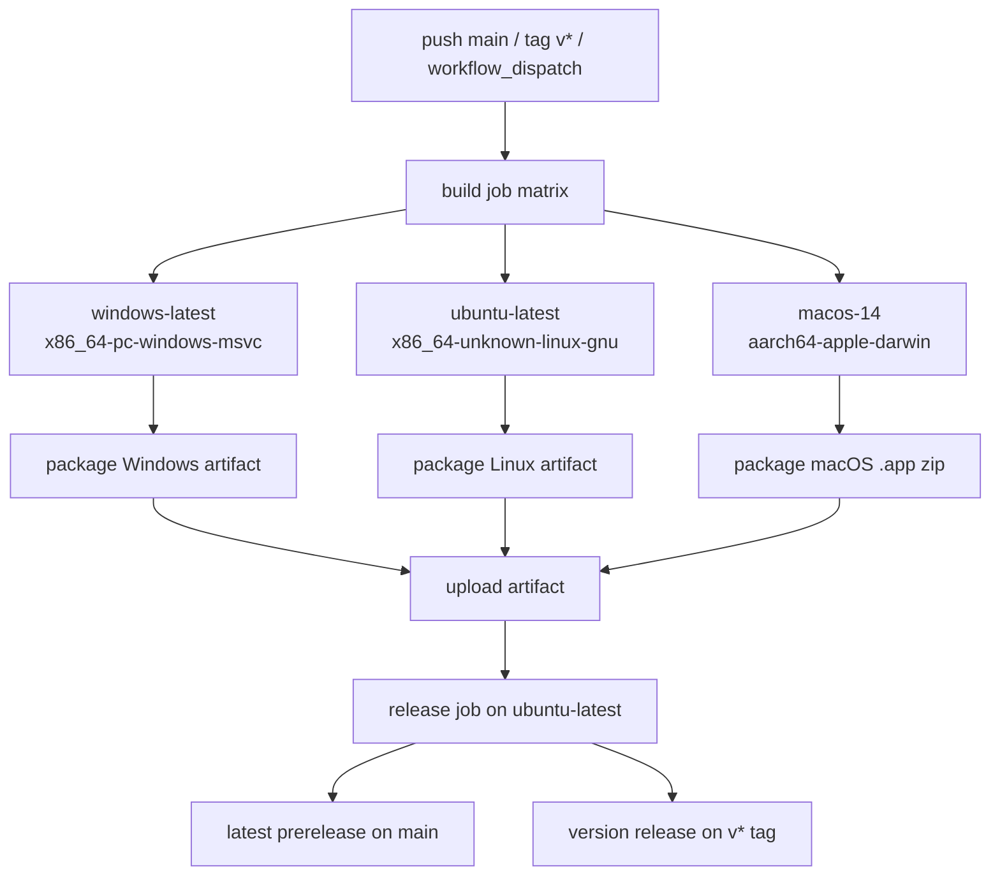

# feat: Add Rust three-platform release workflow

## Overview

将当前基于 Python/PyInstaller 的双平台发布流程，重构为基于 Rust/Cargo 的三平台 GitHub Actions 发布流程。新的 CI 只在 GitHub Actions 上构建，不依赖本地交叉编译环境，目标产物为 Windows x64、Linux x64、macOS arm64，并保留现有用户可感知的启动契约与发布习惯：Windows 提供 `ShenYin.exe`，Linux 提供压缩归档，macOS 提供可双击的 `.app` 压缩包。

## Problem Frame

仓库当前已有统一发版骨架，但构建内容仍是 Python：`.github/workflows/build-and-release.yml` 只构建 Windows x64 与 macOS arm64，依赖 `build_exe.bat`、`build_macos.sh`、`local-workspace.spec` 和 PyInstaller。现在目标变为纯 Rust，并新增 Linux x64 支持，同时明确“不在本地编译，全部交给 GitHub Actions”。

技术上，这不是单纯替换命令，而是要把现有 CI 的三个稳定契约迁移到 Rust：

1. 保留统一 release job 汇总发布，避免多 job 并发写 release。
2. 保留 headless smoke test 语义：启动产物、绑定 `127.0.0.1:19876`、禁止自动打开浏览器、验证 `/` 返回 200。
3. 保留当前用户下载与版本发布模型：`main` 发布 rolling prerelease，`v*` tag 发布正式版。

## Requirements Trace

- R1. GitHub Actions 必须在云端完成 Windows x64、Linux x64、macOS arm64 三平台构建，不依赖本地构建环境。
- R2. workflow 必须从 Python/PyInstaller 切换为 Rust/Cargo 工具链与产物。
- R3. 继续使用单独的 `release` job 汇总 artifact 并统一发布。
- R4. macOS 产物继续保持 `.app` 形态并以 zip 发布。
- R5. Linux 产物新增正式支持，发布格式对终端用户清晰稳定。
- R6. 保留现有启动参数契约与 smoke test 语义：`--host`、`--port`、`--no-browser`。
- R7. 不因为 workflow 改造而改变加密协议、传输格式和现有发布触发方式。

## Scope Boundaries

- 不在本计划内处理本地开发环境的跨平台构建能力。
- 不在本计划内引入代码签名、公证或自动 notarization。
- 不在本计划内扩展到 Windows arm64、Linux arm64 或 Intel macOS。
- 不在本计划内改变加密协议、Base85 文本传输格式或 `/api/*` 行为语义。
- 不要求第一阶段解决所有桌面壳体验问题；重点是 GitHub Actions 构建与发布链路。

## Context & Research

### Relevant Code and Patterns

- 现有发布骨架：`.github/workflows/build-and-release.yml`
- 当前 Windows 构建入口：`build_exe.bat`
- 当前 macOS 构建入口：`build_macos.sh`
- 当前 PyInstaller 配置：`local-workspace.spec`
- 当前应用入口与 CLI 形状：`app.py`
- 当前 smoke test 约束的最小 HTTP 契约：`tests/test_app.py`
- 当前发布文案与下载入口：`README.md`
- 当前 macOS 发布设计参考：`docs/superpowers/specs/2026-03-30-macos-arm64-build-design.md`
- 当前 macOS 发布计划参考：`docs/superpowers/plans/2026-03-30-macos-arm64-build-plan.md`

### Institutional Learnings

- 现有经验明确表明：构建 job 只上传 artifact，由统一 `release` job 下载并发布，可避免 release 竞态与半成品发布。
- macOS 产物不应直接上传 `.app` 目录，应先打 zip；smoke test 需要直接启动打包后应用并验证 HTTP 200。
- artifact 命名应显式包含平台，保持 release 文件对用户可读。

### External References

- GitHub Actions Rust 构建文档：<https://docs.github.com/en/actions/tutorials/build-and-test-code/rust>
- Cargo CI 指南：<https://doc.rust-lang.org/cargo/guide/continuous-integration.html>
- GitHub Actions matrix 文档：<https://docs.github.com/en/actions/how-tos/write-workflows/choose-what-workflows-do/run-job-variations>
- GitHub artifact 文档：<https://docs.github.com/en/actions/tutorials/store-and-share-data>
- `rust-cache` 参考：<https://github.com/marketplace/actions/rust-cache>

## Key Technical Decisions

- 使用单一 matrix build job + 单独 `release` job，而不是继续保留多个完全独立平台 job：Rust 三平台构建结构高度一致，matrix 能减少重复并保持平台差异集中在变量层；release 仍独立保留以避免发布竞态。
- 明确固定 runner，而不是使用 `*-latest` 漂移：Windows 用 `windows-latest`，Linux 用 `ubuntu-latest`，macOS 继续固定 `macos-14` 以保持 arm64 语义可控。
- 在仓库根引入 `rust-toolchain.toml` 固定工具链版本：GitHub-only build 需要可重复性，不能依赖 runner 上预装的默认 Rust。
- macOS 首阶段继续发布 `.app` zip：保持用户体验与当前下载说明一致，避免把桌面应用突然退化为 CLI 产物。
- Windows 保持发布 `ShenYin.exe`，Linux 新增 `ShenYin-linux-x64.tar.gz`，macOS 发布 `ShenYin-macos-arm64.zip`：尽量贴近现有用户习惯，同时给 Linux 一个明确稳定的分发格式。
- smoke test 继续在各平台 build job 执行，release job 不重复验证：问题定位更直接，失败时不会把构建失败与发布失败混在一起。
- 现有 Python 打包文件不在第一提交即删除：待 Rust workflow 稳定并替代后，再统一移除旧 PyInstaller 资产，降低切换风险。

## Open Questions

### Resolved During Planning

- macOS 产物是否保留 `.app`：保留，并继续通过 zip 发布。
- 本地是否需要具备三平台构建能力：不需要，全部通过 GitHub Actions 构建。
- Linux 是否作为首批正式支持平台：是，范围限定为 Linux x64。

### Deferred to Implementation

- Rust 应用采用哪一层 web/server 框架实现现有本地 HTTP 行为：这会影响应用代码，但不影响 workflow 框架，可在实现 Rust 主程序时确定。
- macOS `.app` 具体由哪种打包工具生成：计划只约束产物和 CI 契约，不预先锁死具体 bundle 工具。
- Linux 产物是否包含额外资源目录：取决于 Rust 版是否将静态资源嵌入二进制或随包分发，需在应用实现时确定。

## High-Level Technical Design

> *This illustrates the intended approach and is directional guidance for review, not implementation specification. The implementing agent should treat it as context, not code to reproduce.*

## Implementation Units

- [ ] **Unit 1: Establish the Rust repository release contract**

**Goal:** 为 GitHub Actions Rust 构建建立稳定的仓库级契约，包括 toolchain 固定、Cargo 入口与最小 smoke-test 所需的 CLI 形状。

**Requirements:** R1, R2, R6, R7

**Dependencies:** None

**Files:**
- Create: `Cargo.toml`
- Create: `rust-toolchain.toml`
- Create: `src/main.rs`
- Create: `tests/smoke_contract.rs`
- Modify: `README.md`

**Approach:**
- 定义 Rust 工程的 crate 名称、版本来源和 release profile，让 CI 能直接执行 `cargo test` 与 `cargo build --release`。
- Rust 主入口需要至少保留当前 workflow 依赖的启动参数：`--host`、`--port`、`--no-browser`。
- 为 smoke test 准备一个最小契约测试，确保主页可达或最小服务健康检查行为成立，从而让 CI 的平台级 smoke test 不依赖未定义行为。

**Execution note:** 先建立失败的 smoke-contract 测试，再实现最小可启动服务。

**Patterns to follow:**
- `app.py` 中现有 CLI 参数与本地服务行为
- `tests/test_app.py` 中现有首页 200 与端到端流程预期

**Test scenarios:**
- Happy path — 启动 Rust 应用并传入 `--host 127.0.0.1 --port 19876 --no-browser` 时，服务成功监听并能返回主页 200。
- Edge case — 指定非默认端口时，服务仍绑定到传入端口而不是硬编码端口。
- Error path — 端口被占用时，进程以失败状态退出并给出可诊断错误，而不是挂起。
- Integration — CI 通过 `cargo test` 后，平台 smoke test 启动 release 产物能复用相同启动参数成功访问 `/`。

**Verification:**
- 仓库中存在可由 CI 直接调用的 Rust 工程入口。
- `cargo test` 可作为各平台 build job 的统一测试命令。
- Rust 二进制具备 workflow 所需的最小启动参数与主页响应行为。

- [ ] **Unit 2: Define platform packaging outputs for Windows, Linux, and macOS**

**Goal:** 为三个平台建立明确、稳定、面向用户的打包产物，替代当前 Python/PyInstaller 产物约定。

**Requirements:** R2, R4, R5, R6

**Dependencies:** Unit 1

**Files:**
- Create: `scripts/package-windows.ps1`
- Create: `scripts/package-linux.sh`
- Create: `scripts/package-macos-app.sh`
- Create: `packaging/macos/Info.plist`
- Create: `tests/test_release_artifacts.py`
- Modify: `README.md`

**Approach:**
- Windows 保持单文件 `ShenYin.exe` 作为 release 文件，尽量减少用户迁移成本。
- Linux 统一输出为 `ShenYin-linux-x64.tar.gz`，归档中包含稳定入口名与所需资源。
- macOS 通过 app bundle 生成 `ShenYin.app`，再用保留 bundle 元数据的方式压缩为 `ShenYin-macos-arm64.zip`。
- 平台打包逻辑与 workflow 分离到脚本层，方便在 GitHub Actions 中按平台调用并减少 YAML 内嵌复杂度。

**Patterns to follow:**
- 当前 artifact 命名约定：`.github/workflows/build-and-release.yml`
- 当前 README 下载区块：`README.md`
- 当前 macOS zip 处理经验：`docs/superpowers/specs/2026-03-30-macos-arm64-build-design.md`

**Test scenarios:**
- Happy path — Windows 打包脚本生成 `ShenYin.exe` 且 release job 能直接附加该文件。
- Happy path — Linux 打包脚本生成 `ShenYin-linux-x64.tar.gz`，解压后入口名稳定且与文档一致。
- Happy path — macOS 打包脚本生成 `ShenYin.app` 并压缩为 `ShenYin-macos-arm64.zip`。
- Edge case — 打包脚本在输出目录已存在旧产物时会覆盖或清理旧产物，不会把旧文件混入新包。
- Error path — 缺少预期可执行文件或 bundle 结构时，打包脚本明确失败。
- Integration — release job 下载三平台 artifact 后，其文件名与 workflow `files:` 列表完全匹配。

**Verification:**
- 三个平台均有清晰的打包入口与用户可见文件名。
- README 的下载说明与实际 artifact 文件名一致。
- macOS zip 保留 `.app` 正常解压后的目录结构。

- [ ] **Unit 3: Replace the current workflow with a Rust three-platform matrix build**

**Goal:** 将 `.github/workflows/build-and-release.yml` 从 Python 双平台改为 Rust 三平台 matrix 构建，并在各平台独立运行测试、打包与 smoke test。

**Requirements:** R1, R2, R3, R4, R5, R6, R7

**Dependencies:** Unit 1, Unit 2

**Files:**
- Modify: `.github/workflows/build-and-release.yml`
- Create: `tests/test_release_workflow.py`
- Modify: `README.md`

**Approach:**
- 使用单一 `build` matrix job，matrix 变量至少包含 runner、target triple、artifact name、package script、smoke-test command。
- 在每个平台上依次执行 checkout、Rust toolchain setup、cache restore、`cargo test`、`cargo build --release --target ...`、平台打包脚本、smoke test、artifact upload。
- 固定 runner，不使用 `macos-latest` 漂移；继续使用 `contents: write` 但只赋予 `release` job 发布权限。
- smoke test 保持每个平台本地执行：启动打包后的产物，轮询 `http://127.0.0.1:19876/` 直到成功或超时，然后清理进程。

**Technical design:** *(directional guidance, not implementation specification)*
- matrix 字段建议覆盖：`os`、`target`、`artifact_name`、`package_script`、`smoke_command`、`archive_path`
- 构建 job 输出只上传 artifact，不直接触碰 release
- release job 通过 `needs: build` 保证三平台全部成功后才发布

**Patterns to follow:**
- 现有 unified release 结构：`.github/workflows/build-and-release.yml`
- 现有 smoke test 契约：`.github/workflows/build-and-release.yml`、`tests/test_app.py`

**Test scenarios:**
- Happy path — `main` push 触发三平台 matrix build，全部成功后生成 rolling prerelease。
- Happy path — `v*` tag 触发三平台 matrix build，release job 发布三份资产。
- Edge case — 单个平台构建失败时，release job 不执行，避免半成品发布。
- Edge case — 重新运行失败的 build job 后，新的 artifact 能覆盖旧 artifact 并驱动新的 release 结果。
- Error path — smoke test 超时或 HTTP 非 200 时，该平台 job 失败且 release job 不发布。
- Error path — artifact 上传或下载名称不匹配时，release job 明确失败，不静默漏发平台。
- Integration — matrix 中三个 target 的产物命名与 README、release body、download-artifact 配置一致。

**Verification:**
- workflow 能在 GitHub Actions 上独立完成三平台构建，无需本地参与。
- 构建逻辑从 Python/pip/PyInstaller 全量切换到 Rust/Cargo。
- 三个平台失败时能快速定位到具体 build leg，而不是混在 release 流程中。

- [ ] **Unit 4: Rebuild the release aggregation and user-facing release contract**

**Goal:** 保留现有发布模型，但将其更新为 Rust 三平台资产与说明，确保主分支 rolling prerelease 和 tag release 行为一致。

**Requirements:** R3, R4, R5, R7

**Dependencies:** Unit 3

**Files:**
- Modify: `.github/workflows/build-and-release.yml`
- Modify: `README.md`
- Create: `tests/test_release_notes.py`

**Approach:**
- release job 继续在 `ubuntu-latest` 上执行，统一下载所有 artifact 并发布。
- `main` 上继续维护 `latest` rolling prerelease；`v*` tag 上继续发布正式版本。
- release body 更新为 Windows x64、Linux x64、macOS arm64 三平台 Rust 产物说明，并保留 macOS 未签名提醒。
- README 的下载说明、发布说明、开发说明需要从 Python 叙事迁移到 Rust 叙事，但避免在同一提交中展开过多架构说明。

**Patterns to follow:**
- 当前 release 模型：`.github/workflows/build-and-release.yml`
- 当前用户下载说明：`README.md`

**Test scenarios:**
- Happy path — `main` 触发时，`latest` prerelease body 正确列出三平台资产。
- Happy path — `v*` tag 触发时，正式 release body 正确列出三平台资产与 macOS 提示。
- Edge case — 同一提交既存在 `main` 触发又存在 tag 触发时，两种发布路径不会互相覆盖错误资产。
- Error path — release job 缺少任一 artifact 时失败，不发布不完整版本。
- Integration — README 下载文件名、workflow 上传 artifact 名称、release 附件文件名三者一致。

**Verification:**
- 用户从 README 和 release 页面看到的文件名、平台说明与实际下载完全一致。
- GitHub Releases 页面不再暴露 Python/PyInstaller 术语或旧平台范围描述。

## System-Wide Impact

- **Interaction graph:** 构建系统将从 Python/pip/PyInstaller 转为 Rust/Cargo + 平台打包脚本；应用入口、文档入口、release 页面都会受影响。
- **Error propagation:** 平台构建失败、smoke test 失败、artifact 缺失，都必须在 build 或 release job 中明确失败并阻断发布。
- **State lifecycle risks:** `latest` tag 移动、artifact 覆盖、release 复跑需要保持幂等，否则会出现旧文件残留或错误资产混入。
- **API surface parity:** 用户可见的 CLI 参数、下载文件名和 HTTP 首页可达性需要保持一致，以减少迁移成本。
- **Integration coverage:** 仅靠单元测试无法证明打包后的二进制/`.app` 真正可启动，因此每个平台都需要独立 smoke test。
- **Unchanged invariants:** `main` -> rolling prerelease、`v*` -> 正式 release 的触发方式不变；加密协议与传输格式不变。

## Risks & Dependencies

| Risk | Mitigation |
|------|------------|
| Rust 应用在 CI 中可编译，但打包后无法满足现有 smoke test 契约 | 在 Unit 1 先固定 CLI 和最小 HTTP 契约，并在 Unit 3 对每个平台执行打包后 smoke test |
| macOS `.app` 生成方式选型过早导致 workflow 被工具细节绑死 | 计划只锁定产物形态与 CI 契约，不在 planning 阶段锁死具体 bundle 工具 |
| release job 文件名与 build job 产物名不一致导致漏发 | 通过专门的 workflow/notes regression tests 校验 artifact 名称、README、release body 一致性 |
| `latest` 与 tag 触发对同一提交发生重叠，导致资产覆盖或描述错乱 | 将发布逻辑集中在单独 release job，并使 `main`/`v*` 分支判断明确互斥 |
| Linux 产物格式与解压后入口不稳定，影响用户使用 | 在 Unit 2 明确 Linux 归档命名与解压后入口名，并在 README 中同步说明 |

## Documentation / Operational Notes

- `README.md` 需要从“纯 Python 引擎 + 下载 EXE/zip”叙事迁移到“Rust 三平台发布”叙事，但用户看到的下载入口应保持简单。
- 若后续需要 macOS 签名、公证或 Gatekeeper 体验优化，应另开后续计划，不与当前 workflow 切换耦合。
- 旧的 `build_exe.bat`、`build_macos.sh`、`local-workspace.spec` 在 Rust workflow 完成替换前可暂时保留；替换完成后建议单独做一次清理提交。

## Current Execution Progress

### Snapshot on 2026-04-13

**Done so far**

- 已确认当前 `.github/workflows/build-and-release.yml` 仍是 Python/PyInstaller 双平台构建，只包含 Windows x64 与 macOS arm64 build job。
- 已确认现有 unified `release` job 骨架可复用，后续 Rust 三平台可以继续通过单独 release job 聚合 artifact。
- 已确认本次迁移不依赖本地三平台编译能力，Windows 本机不具备 Linux 交叉编译环境已不构成阻塞，因为构建全部放在 GitHub Actions。
- 已确认现有应用最小启动契约来自 `app.py`：`--host`、`--port`、`--no-browser`。
- 已确认现有 smoke test 最小 HTTP 契约来自 `tests/test_app.py` 与 workflow：访问 `/` 需返回 HTTP 200。
- 已确认现有加密与传输兼容性硬约束来自 `pgpbox/engine.py`、`pgpbox/crypto.py`、`pgpbox/transport.py`，包括 AES-256-GCM、PBKDF2-HMAC-SHA256（600,000 次）、payload framing、压缩选项与 Base85 文本传输。
- 已通过本地实测确认 Python `base64.b85encode` 使用的字母表，后续 Rust 文本模式必须对齐该编码行为与 76 列换行规则。
- 已新增设计规格文档：`docs/superpowers/specs/2026-04-13-rust-three-platform-build-design.md`。

**In progress**

- 正在执行 Unit 1，准备先建立 Rust 工程入口、固定 toolchain，并以最小可启动服务满足 smoke-test contract。
- 还未开始修改 `.github/workflows/build-and-release.yml`、README 或三平台打包脚本。

**Next planned moves**

1. 建立 `Cargo.toml`、`rust-toolchain.toml`、`src/main.rs`、`tests/smoke_contract.rs`。
2. 建立三平台打包脚本与 macOS bundle 元数据。
3. 将 workflow 从 Python 双平台切换到 Rust 三平台 matrix build。
4. 更新 README 与 release 文案，使下载说明和 artifact 命名一致。

## Sources & References

- Related workflow: `.github/workflows/build-and-release.yml`
- Related app contract: `app.py`
- Related smoke tests: `tests/test_app.py`
- Related docs: `docs/superpowers/specs/2026-03-30-macos-arm64-build-design.md`
- Related docs: `docs/superpowers/plans/2026-03-30-macos-arm64-build-plan.md`
- External docs: <https://docs.github.com/en/actions/tutorials/build-and-test-code/rust>
- External docs: <https://doc.rust-lang.org/cargo/guide/continuous-integration.html>
- External docs: <https://github.com/marketplace/actions/rust-cache>
